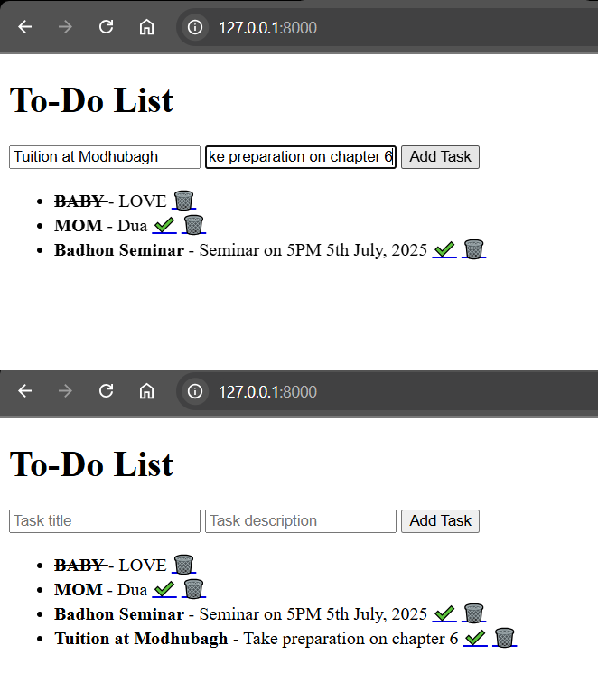

# todo-django
In this project a ToDo list manager will be created using Django.

### 🎯 **Project: “Personal To-Do List App”**

---

## ✅ Features:

* Add tasks with a title and description
* Mark tasks as completed
* Delete tasks

---

## 🛠️ Step-by-Step Guide with Code

---

### 🧩 **Step 1: Install Django**

Open your terminal:

```bash
pip install django
```

---

### 🧩 **Step 2: Create the Django Project**

```bash
django-admin startproject todoproject
cd todoproject
python manage.py startapp todo
```

---

### 🧩 **Step 3: Add `todo` App to Settings**

In `todoproject/settings.py`, add `'todo'` to `INSTALLED_APPS`:

```python
INSTALLED_APPS = [
    ...
    'todo',
]
```

---

### 🧩 **Step 4: Create Models**

In `todo/models.py`:

```python
from django.db import models

class Task(models.Model):
    title = models.CharField(max_length=200)
    description = models.TextField(blank=True)
    completed = models.BooleanField(default=False)

    def __str__(self):
        return self.title
```

---

### 🧩 **Step 5: Migrate Database**

```bash
python manage.py makemigrations
python manage.py migrate
```

---

### 🧩 **Step 6: Create Admin User (Optional)**

```bash
python manage.py createsuperuser
```

Follow prompts to set username and password.

---

### 🧩 **Step 7: Register Model in Admin**

In `todo/admin.py`:

```python
from django.contrib import admin
from .models import Task

admin.site.register(Task)
```

---

### 🧩 **Step 8: Create Views**

In `todo/views.py`:

```python
from django.shortcuts import render, redirect
from .models import Task

def index(request):
    tasks = Task.objects.all()
    if request.method == "POST":
        title = request.POST.get('title')
        desc = request.POST.get('description')
        Task.objects.create(title=title, description=desc)
        return redirect('/')
    return render(request, 'todo/index.html', {'tasks': tasks})

def delete_task(request, task_id):
    task = Task.objects.get(id=task_id)
    task.delete()
    return redirect('/')

def complete_task(request, task_id):
    task = Task.objects.get(id=task_id)
    task.completed = True
    task.save()
    return redirect('/')
```

---

### 🧩 **Step 9: Create URLs**

In `todo/urls.py` (create this file):

```python
from django.urls import path
from . import views

urlpatterns = [
    path('', views.index, name='index'),
    path('delete/<int:task_id>/', views.delete_task, name='delete_task'),
    path('complete/<int:task_id>/', views.complete_task, name='complete_task'),
]
```

In `todoproject/urls.py`:

```python
from django.contrib import admin
from django.urls import path, include

urlpatterns = [
    path('admin/', admin.site.urls),
    path('', include('todo.urls')),
]
```

---

### 🧩 **Step 10: Create Templates Folder**

Create directory: `todo/templates/todo/index.html`

#### 📄 `index.html`

```html
<!DOCTYPE html>
<html>
<head>
    <title>My To-Do List</title>
</head>
<body>
    <h1>To-Do List</h1>
    <form method="post">
        
        <input type="text" name="title" placeholder="Task title" required>
        <input type="text" name="description" placeholder="Task description">
        <button type="submit">Add Task</button>
    </form>

    <ul>
        
            <li>
                <strong  style="text-decoration: line-through;" >
                    {{ task.title }}
                </strong> - {{ task.description }}
                
                    <a href="">✔️</a>
                
                <a href="">🗑️</a>
            </li>
        
    </ul>
</body>
</html>
```

---

### ✅ Final Step: Run the App!

```bash
python manage.py runserver
```

Visit [http://127.0.0.1:8000](http://127.0.0.1:8000) in your browser.

---
### Output in Browser!



